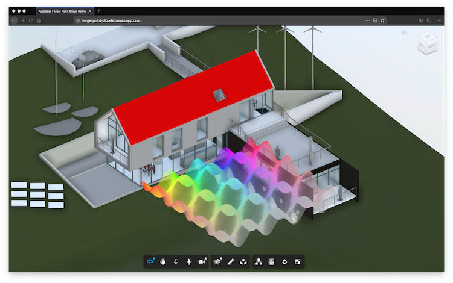
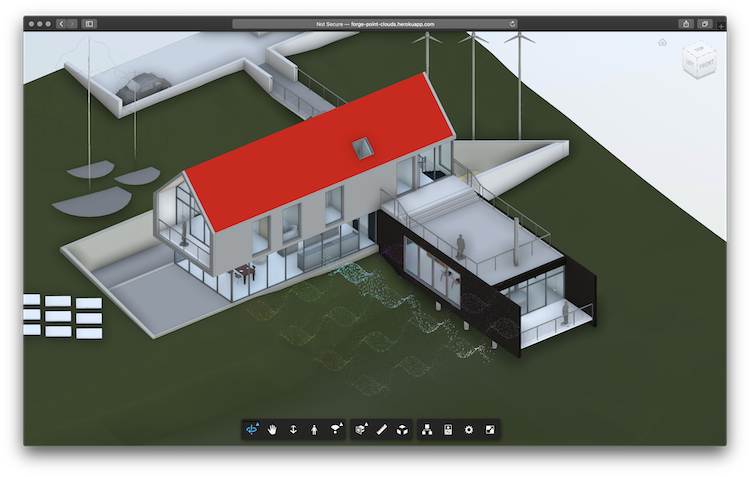
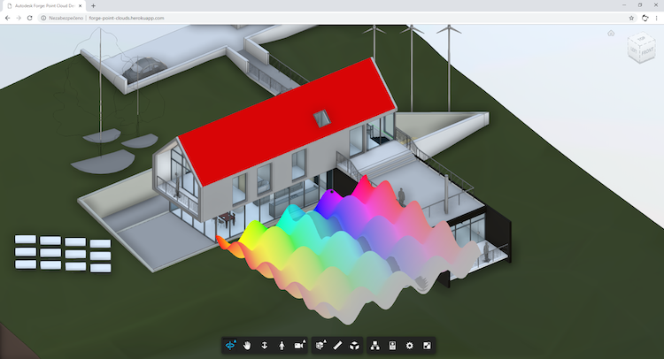
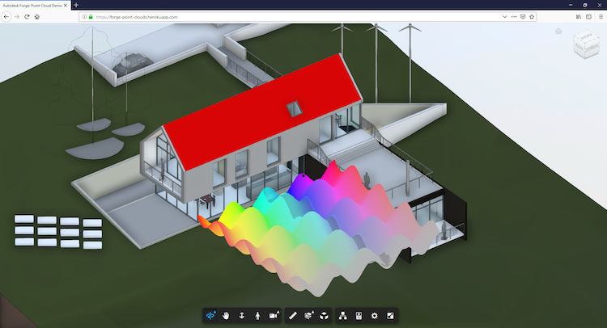
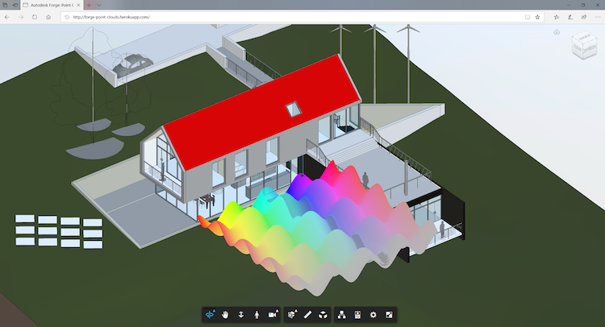
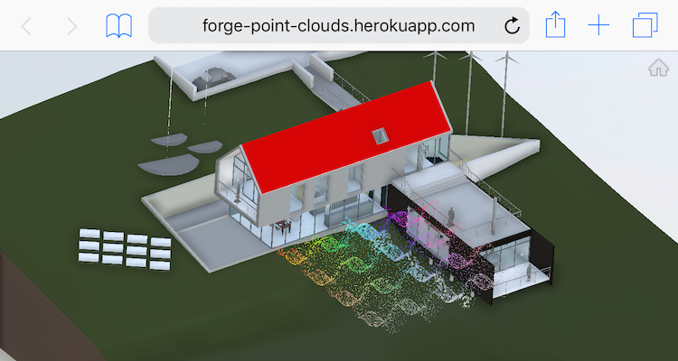

# forge-point-clouds

Experimental integration of [THREE.PointCloud](https://github.com/mrdoob/three.js/blob/r71/src/objects/PointCloud.js)
into [Autodesk Forge](https://forge.autodesk.com) Viewer.

[Live Demo](https://forge-point-clouds.herokuapp.com)

## Development

### Prerequisites

- [Node.js](https://nodejs.org) version 8 or newer
- Forge application ([tutorial](https://forge.autodesk.com/en/docs/oauth/v2/tutorials/create-app))
- Viewable 3D model ([tutorial](https://forge.autodesk.com/en/docs/model-derivative/v2/tutorials/prepare-file-for-viewer))

### Setup & Run

- install dependencies: `npm install`
- run the server with `FORGE_CLIENT_ID`, `FORGE_CLIENT_SECRET`, and `MODEL_URN` env. variables
  ```bash
  export FORGE_CLIENT_ID=<your client id>
  export FORGE_CLIENT_SECRET=<your client secret>
  export MODEL_URN=<your model urn>
  node server.js
  ```
- alternatively, if you're using [Visual Studio Code](https://code.visualstudio.com),
  use the following _.vscode/launch.json_ configuration:
  ```json
  {
      "version": "0.2.0",
      "configurations": [
          {
              "type": "node",
              "request": "launch",
              "name": "Launch Server",
              "program": "${workspaceFolder}/server.js",
              "env": {
                  "FORGE_CLIENT_ID": "<your client id>",
                  "FORGE_CLIENT_SECRET": "<your client secret>",
                  "MODEL_URN": "<your model urn>"
              }
          }
      ]
  }
  ```
- go to http://localhost:3000

## Browser Support

### Chrome/macOS


### Firefox/macOS



### Safari/macOS



### Chrome/Win10



### Firefox/Win10



### Edge/Win10



### Safari/iOS


